# Software Architecture

## Zero Trust IAM Reference

**Version:** 1.0.0  
**Author:** Abhishek Gaddam  
**Architecture Style:** Layered, stateless REST application  
**Primary Domain:** Identity and Access Management (IAM)

---

## 1. Purpose

Zero Trust IAM Reference is an open-source educational reference implementation demonstrating foundational Identity and Access Management concepts with Java and Spring Boot.

The project illustrates:

- Secure user registration
- Password-policy validation
- BCrypt password hashing
- Stateless JWT authentication
- Role-Based Access Control
- Protected REST APIs
- Security-event audit logging
- Health monitoring
- Layered application design

The implementation uses publicly available technologies and does not contain proprietary employer code, confidential business logic, or organization-specific security configurations.

---

## 2. Architecture Goals

The architecture is designed to:

1. Separate API, security, business, and persistence responsibilities.
2. Authenticate every protected request independently.
3. Avoid server-side authentication sessions.
4. Store passwords only as secure BCrypt hashes.
5. Apply least-privilege access through role-based authorization.
6. record important identity-related events for auditing.
7. Remain understandable and extensible for educational use.
8. Provide a foundation for future capabilities such as MFA, token rotation, account lockout, and observability.

---

## 3. System Context

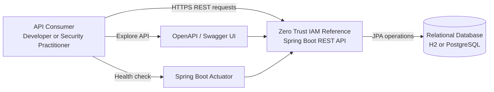

### External actors and systems

| Actor or System | Purpose |
|---|---|
| API consumer | Registers, authenticates, and accesses protected resources |
| H2 database | Local development and testing database |
| PostgreSQL | Supported external relational database |
| Swagger UI | Interactive API documentation |
| Spring Boot Actuator | Application health monitoring |

---

## 4. High-Level Architecture

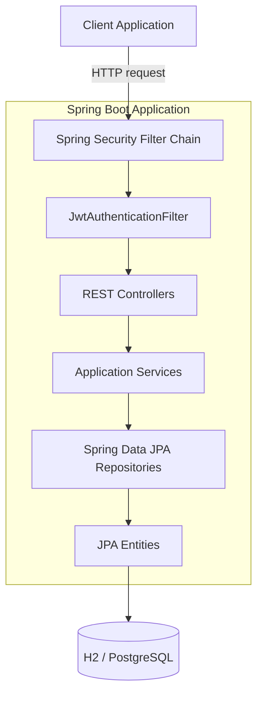

The application uses a layered architecture:

- **Presentation layer:** REST controllers and DTOs
- **Security layer:** Spring Security, JWT validation, and authorization
- **Service layer:** Registration, login, password-policy, and audit workflows
- **Persistence layer:** Spring Data JPA repositories
- **Data layer:** User, role, and audit records

---

## 5. Component Architecture

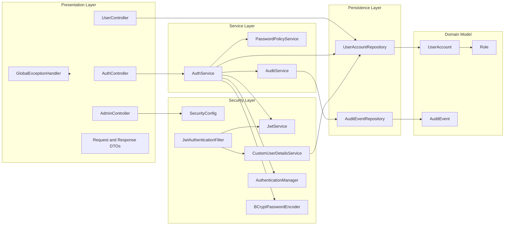

---

## 6. Package Structure

```text
com.abhishek.zerotrustiam
├── config
│   └── SecurityConfig
├── controller
│   ├── AdminController
│   ├── AuthController
│   └── UserController
├── dto
│   ├── ApiResponse
│   ├── AuthResponse
│   ├── LoginRequest
│   ├── RegisterRequest
│   └── UserProfileResponse
├── entity
│   ├── AuditEvent
│   ├── Role
│   └── UserAccount
├── exception
│   └── GlobalExceptionHandler
├── repository
│   ├── AuditEventRepository
│   └── UserAccountRepository
├── security
│   ├── CustomUserDetailsService
│   ├── JwtAuthenticationFilter
│   └── JwtService
└── service
    ├── AuditService
    ├── AuthService
    └── PasswordPolicyService
```

---

## 7. Layer Responsibilities

### 7.1 Presentation Layer

The presentation layer exposes REST endpoints and converts incoming requests into application operations.

Primary components:

- `AuthController`
- `UserController`
- `AdminController`
- Request and response DTOs
- `GlobalExceptionHandler`

Responsibilities:

- Receive and validate API requests
- Return structured HTTP responses
- Delegate application logic to services
- Avoid embedding security or persistence logic in controllers
- Translate exceptions into API error responses

---

### 7.2 Security Layer

The security layer protects API resources and establishes the authenticated user for each request.

Primary components:

- `SecurityConfig`
- `JwtAuthenticationFilter`
- `JwtService`
- `CustomUserDetailsService`
- Spring `AuthenticationManager`
- `BCryptPasswordEncoder`

Responsibilities:

- Configure public and protected endpoints
- Enforce stateless session management
- Parse and validate bearer tokens
- Load user identity and authorities
- Populate the Spring Security context
- Enforce role-based access
- Hash and verify passwords

---

### 7.3 Service Layer

The service layer implements application workflows.

Primary components:

- `AuthService`
- `PasswordPolicyService`
- `AuditService`

Responsibilities:

- Prevent duplicate account registration
- Normalize email addresses
- Validate passwords
- Hash passwords before persistence
- Assign the default `USER` role
- Authenticate login credentials
- Generate JWT access tokens
- Record successful and unsuccessful security events

---

### 7.4 Persistence Layer

The persistence layer provides database access through Spring Data JPA.

Primary components:

- `UserAccountRepository`
- `AuditEventRepository`

Responsibilities:

- Persist and retrieve user accounts
- Locate users by email
- Check whether an email is already registered
- Persist security audit records
- Abstract database-specific operations from services

---

## 8. Request Processing Flow

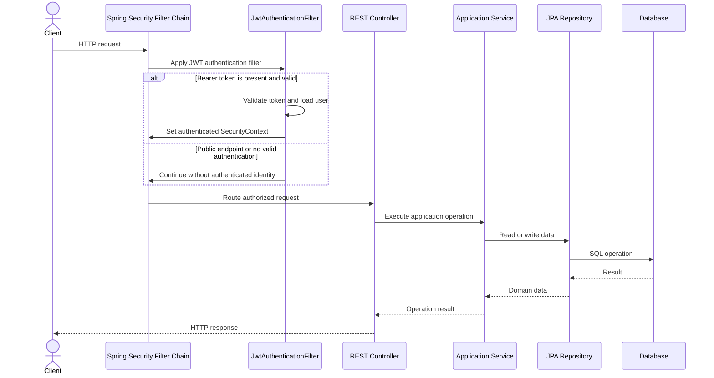

For protected endpoints, Spring Security evaluates the authenticated identity and required authority before allowing the controller to execute.

---

## 9. User Registration Flow

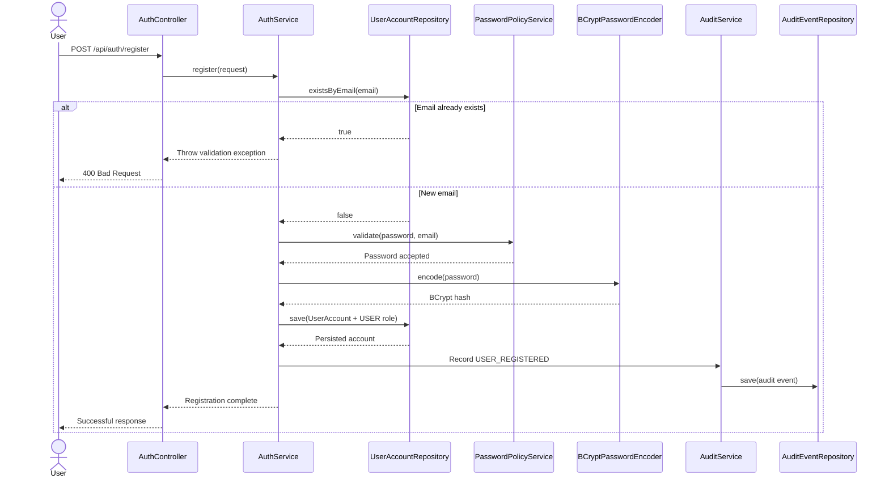

### Registration controls

- Email uniqueness is checked before persistence.
- Email addresses are normalized to lowercase.
- Passwords are validated by `PasswordPolicyService`.
- Plaintext passwords are never persisted.
- BCrypt uses strength factor `12`.
- New accounts receive the default `USER` role.
- Successful registration produces a `USER_REGISTERED` audit event.

---

## 10. Login and Token Issuance Flow

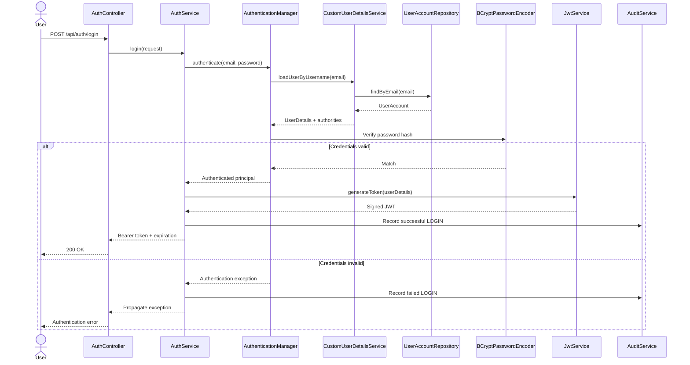

---

## 11. JWT Validation Flow

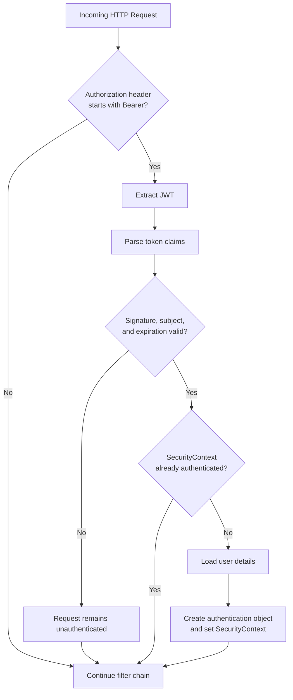

The application does not create or maintain an HTTP session. Every protected request must provide a valid JWT.

---

## 12. Authorization Model

The application uses Role-Based Access Control.

Current roles:

- `USER`
- `ADMIN`

Spring Security converts these roles into authorities such as:

- `ROLE_USER`
- `ROLE_ADMIN`

### Endpoint authorization matrix

| Endpoint pattern | Access requirement |
|---|---|
| `/api/auth/**` | Public |
| `/swagger-ui/**` | Public |
| `/v3/api-docs/**` | Public |
| `/h2-console/**` | Public for local development |
| `/actuator/health` | Public |
| `/api/admin/**` | `ROLE_ADMIN` |
| All other endpoints | Authenticated user |

### Authorization flow

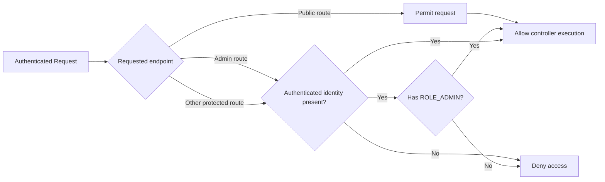

---

## 13. Data Model

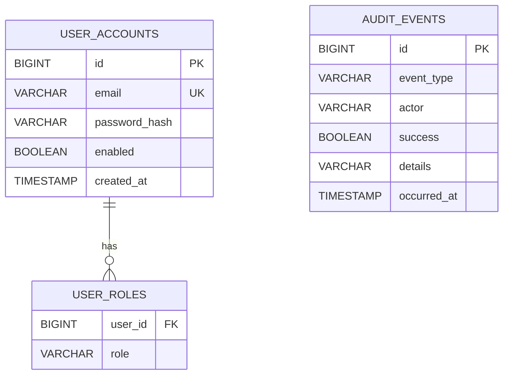

### Important implementation detail

`Role` is an enum stored through JPA `@ElementCollection`. It is not a separate role entity with its own repository.

The `user_roles` table associates one user account with one or more enum-based roles.

Audit events record an actor identifier, but the current data model does not enforce a database foreign-key relationship between `audit_events.actor` and `user_accounts.email`. This allows audit records to capture failed login attempts for identities that may not exist.

---

## 14. Entity Definitions

### UserAccount

| Field | Purpose |
|---|---|
| `id` | Generated primary key |
| `email` | Unique user identifier |
| `passwordHash` | BCrypt-hashed credential |
| `roles` | Set of enum-based roles |
| `enabled` | Indicates whether the account is enabled |
| `createdAt` | Account creation timestamp |

### AuditEvent

| Field | Purpose |
|---|---|
| `id` | Generated primary key |
| `eventType` | Type of security event |
| `actor` | Identity associated with the event |
| `success` | Whether the operation succeeded |
| `details` | Human-readable event context |
| `occurredAt` | Event timestamp |

---

## 15. Security Controls

| Control | Implementation |
|---|---|
| Credential confidentiality | Passwords stored as BCrypt hashes |
| Password hashing strength | BCrypt cost factor 12 |
| Authentication | Username/password login with JWT issuance |
| Session management | Stateless |
| API authorization | Spring Security route rules |
| Privileged access | `ROLE_ADMIN` required for `/api/admin/**` |
| Input validation | Jakarta validation and password-policy service |
| Duplicate identity prevention | Unique email constraint and repository check |
| Security auditing | Registration and login events persisted |
| Health monitoring | Spring Boot Actuator |
| Error handling | Centralized global exception handler |
| Database abstraction | Spring Data JPA |

---

## 16. Trust Boundaries

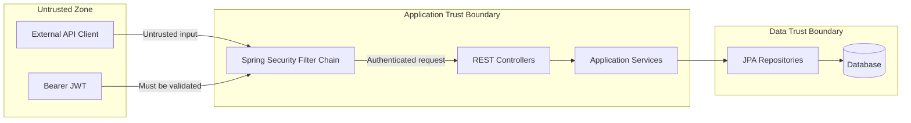

### Boundary assumptions

- Inputs from API clients are untrusted.
- JWT claims are trusted only after cryptographic validation.
- Controllers should not bypass the service and security layers.
- Database access is performed through repositories.
- JWT signing secrets must be supplied securely in non-development environments.
- Transport encryption should be enforced by the deployment environment.

---

## 17. Deployment Architecture

### Local development

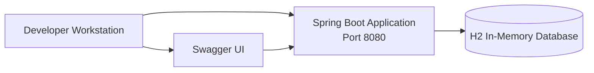

### Containerized deployment

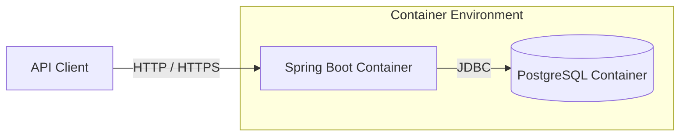

The repository includes:

- `Dockerfile`
- `docker-compose.yml`
- H2 support for local execution
- PostgreSQL support for containerized or external deployment

---

## 18. Runtime Configuration

Configuration is externalized through Spring Boot configuration.

Important categories include:

- Database connection
- JWT issuer
- JWT signing secret
- Token expiration
- Application port
- Swagger UI path
- Actuator endpoint exposure

### Production recommendation

Sensitive values such as JWT signing keys and database credentials should be provided through environment variables or a secrets-management platform rather than committed to source control.

---

## 19. Zero Trust Alignment

This project demonstrates selected Zero Trust principles but does not claim to provide a complete Zero Trust platform.

| Principle | Current implementation |
|---|---|
| Verify explicitly | Protected requests require a validated JWT |
| Least-privilege access | Role-based endpoint restrictions |
| Assume breach | Stateless validation and audit-event recording |
| Strong identity | Password policy, BCrypt, and token-based identity |
| Continuous visibility | Health endpoint and security audit records |
| Minimize implicit trust | Authentication is evaluated on every protected request |

Additional controls such as MFA, risk-based authentication, token revocation, device trust, and policy-based access are planned enhancements.

---

## 20. Current Limitations

Version 1.0.0 intentionally focuses on foundational IAM capabilities.

Current limitations include:

- No Multi-Factor Authentication
- No refresh-token mechanism
- No access-token revocation
- No password-reset workflow
- No email verification
- No account-lockout policy
- No rate limiting
- No administrative role-management API
- No external identity provider
- No OAuth2 or OpenID Connect
- No centralized secrets-management integration
- No distributed tracing
- Limited automated test coverage
- H2 console access is intended only for local development
- CSRF protection is disabled because the API is stateless and bearer-token based

These limitations should be addressed before adapting the implementation for production use.

---

## 21. Architecture Roadmap

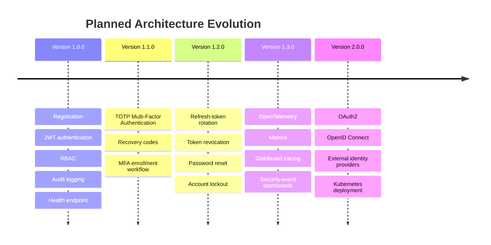

---

## 22. Design Decisions

### Stateless authentication

JWT authentication was selected to demonstrate independently verifiable API requests without server-side session storage.

### BCrypt password hashing

BCrypt was selected because it is adaptive, salted, and widely supported by Spring Security.

### Enum-based roles

Roles are represented as an enum and persisted as an element collection to keep the initial authorization model simple and explicit.

### Layered architecture

Layered separation keeps HTTP concerns, security logic, business rules, and data access independent.

### H2 and PostgreSQL support

H2 provides low-friction local development, while PostgreSQL demonstrates portability to an external relational database.

### Persistent audit records

Audit events are stored in the database to demonstrate traceability of identity-related operations.

---

## 23. Quality Attributes

| Attribute | Architectural response |
|---|---|
| Security | Spring Security, BCrypt, JWT, RBAC, and audit logging |
| Maintainability | Layered packages and separation of concerns |
| Testability | Dependency injection and service-level components |
| Portability | Java, Spring Boot, Maven, H2, and PostgreSQL |
| Extensibility | Roadmap supports MFA, OIDC, and observability |
| Operability | Actuator health endpoint and Docker support |
| Usability | Swagger/OpenAPI documentation |
| Traceability | Persistent registration and login audit events |

---

## 24. Educational and Public-Use Scope

This repository is intended as an educational and technical reference for:

- Software developers learning secure API design
- Cybersecurity professionals studying IAM fundamentals
- Enterprise IAM engineers evaluating implementation patterns
- Students learning Spring Security and JWT
- Open-source contributors interested in identity security

It should not be represented as a complete, production-certified IAM product.

---

## 25. Conclusion

Zero Trust IAM Reference provides a structured foundation for learning and extending modern Identity and Access Management capabilities.

The current architecture demonstrates:

- Layered Java application design
- Secure password handling
- Stateless authentication
- Role-based authorization
- Protected API access
- Security-event auditing
- Relational persistence
- Operational health monitoring

Future releases will evolve the project toward stronger authentication, improved token lifecycle management, enhanced observability, and standards-based identity federation.