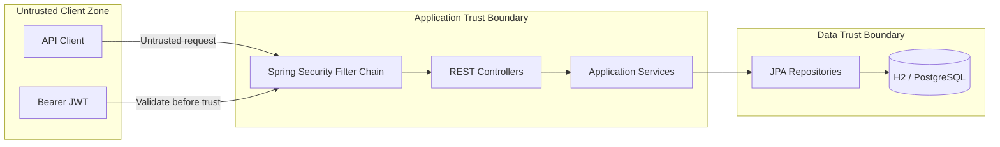

# Threat Model

## Zero Trust IAM Reference

**Version:** 1.0.0  
**Author:** Abhishek Gaddam  
**Method:** STRIDE-informed application threat analysis

## 1. Purpose

This document identifies security threats affecting the authentication, authorization, token-processing, persistence, audit, and deployment boundaries of Zero Trust IAM Reference.

The analysis is scoped to the public educational implementation. It does not describe proprietary employer systems or organization-specific security controls.

## 2. Scope

Included:

- User registration and login
- Password processing and storage
- JWT issuance and validation
- Role-Based Access Control (RBAC)
- Protected REST endpoints
- Audit-event persistence
- H2 and PostgreSQL database access
- Local and containerized deployment
- CI build execution

Excluded:

- Employer-specific identity systems
- Proprietary authentication flows
- Mainframe or financial-institution implementation details
- Enterprise network architecture
- Production SOC operations
- Third-party identity-provider internals

## 3. Security Objectives

- Protect user credentials from disclosure.
- Prevent unauthorized access to protected APIs.
- Prevent unauthorized elevation to administrative privileges.
- Preserve the integrity of JWT claims and audit records.
- Maintain traceability for registration and login activity.
- Minimize implicit trust between clients and protected resources.
- Keep development defaults from being mistaken for production controls.

## 4. Assets

| Asset | Security requirement |
|---|---|
| User passwords | Confidentiality and irreversible storage |
| JWT signing secret | Confidentiality and integrity |
| JWT access tokens | Confidentiality, integrity, and limited lifetime |
| User identity records | Confidentiality and integrity |
| Role assignments | Integrity |
| Audit events | Integrity, availability, and traceability |
| API endpoints | Availability and access control |
| Database credentials | Confidentiality |
| Source code and CI workflow | Integrity |

## 5. Trust Boundaries

## 6. Threat Summary

| ID | Threat | Category | Risk | Current controls | Planned improvement |
|---|---|---|---|---|---|
| TM-01 | Credential stuffing | Spoofing | High | Password policy, BCrypt hashing | Rate limiting, breached-password screening, lockout |
| TM-02 | Brute-force login attempts | Spoofing / DoS | High | BCrypt cost factor and audit records | Attempt throttling and progressive delay |
| TM-03 | Weak password selection | Spoofing | Medium | Password-policy validation | Compromised-password screening |
| TM-04 | JWT theft | Spoofing | High | Short-lived signed access tokens | Refresh rotation, revocation, sender-constrained tokens |
| TM-05 | JWT modification | Tampering | High | Signature validation | Asymmetric signing and managed key rotation |
| TM-06 | Expired-token reuse | Spoofing | Medium | Expiration validation | Automated negative integration tests |
| TM-07 | Privilege escalation | Elevation of privilege | High | Role-based endpoint rules | Fine-grained permissions and administrative approval |
| TM-08 | Role-data tampering | Tampering | High | Server-side persistence and authorization | Restricted role-management API and immutable audit |
| TM-09 | Missing or altered audit records | Repudiation | Medium | Persistent registration and login records | Centralized append-only logging and SIEM export |
| TM-10 | Sensitive information in errors | Information disclosure | Medium | Central exception handling | Standardized problem responses and log redaction |
| TM-11 | JWT secret leakage | Information disclosure | Critical | External configuration support | Vault-backed secrets and scheduled rotation |
| TM-12 | Database credential leakage | Information disclosure | High | Environment-based configuration | Managed secret store and least-privilege DB account |
| TM-13 | Excessive request volume | Denial of service | High | None in v1.0.0 | Gateway rate limiting and resource limits |
| TM-14 | H2 console exposure | Information disclosure | High outside local use | Intended for development only | Disable by profile in non-development environments |
| TM-15 | Unencrypted transport | Information disclosure | Critical | TLS required by deployment assumption | Enforce HTTPS at proxy or platform |
| TM-16 | Vulnerable dependency | Tampering / EoP | High | Maven CI build | Dependabot and dependency scanning |
| TM-17 | Compromised CI dependency/action | Tampering | Medium | Official GitHub actions | Pin actions, least-privilege workflow permissions |
| TM-18 | Audit log flooding | DoS / Repudiation | Medium | Database persistence | Retention, quotas, centralized ingestion |

## 7. STRIDE Analysis

### Spoofing

Primary risks:

- Stolen credentials
- Credential stuffing
- Stolen or replayed JWTs
- Forged identity claims

Current controls:

- Authentication through Spring Security
- BCrypt password hashing
- Signed JWT validation
- Token-expiration validation
- User lookup during request authentication

Residual risk:

The application does not yet implement MFA, refresh-token rotation, revocation, device binding, or adaptive authentication.

### Tampering

Primary risks:

- Modified JWT claims
- Unauthorized role changes
- Altered user or audit records
- Malicious changes to build configuration

Current controls:

- Cryptographic JWT signatures
- Server-side authority loading
- Repository-mediated persistence
- Version-controlled source and CI

Residual risk:

Production deployments require managed keys, restricted database privileges, protected branches, and stronger software-supply-chain controls.

### Repudiation

Primary risks:

- A user denies registering or logging in.
- Failed authentication attempts cannot be investigated.
- Audit records are altered or deleted.

Current controls:

- Timestamped registration and login audit events
- Actor, event type, outcome, and details are persisted

Residual risk:

The database audit store is not append-only and is not exported to a centralized security-monitoring platform.

### Information Disclosure

Primary risks:

- Plaintext password exposure
- JWT or secret leakage
- Database credential disclosure
- Sensitive exception output
- Accidental H2-console exposure

Current controls:

- BCrypt password storage
- Configuration externalization
- Central exception handling
- Production TLS requirement

Residual risk:

Secure secret storage, structured redaction, environment-specific profiles, and HTTPS enforcement remain deployment responsibilities.

### Denial of Service

Primary risks:

- Repeated login or registration requests
- Expensive BCrypt operations at high volume
- Database connection exhaustion
- Audit-event flooding

Current controls:

- No dedicated application-level rate limiting in v1.0.0

Planned controls:

- Reverse-proxy or API-gateway throttling
- Resource limits
- Connection-pool tuning
- Account-based progressive delays
- Monitoring and alerting

### Elevation of Privilege

Primary risks:

- A `USER` accesses an administrator endpoint.
- Role data is manipulated.
- Authorization is bypassed through a new endpoint.

Current controls:

- `/api/admin/**` requires `ROLE_ADMIN`
- Other protected routes require authentication
- Authorities are established by the application

Residual risk:

New endpoints require security tests and review. The current release does not provide a role-administration workflow.

## 8. Abuse Cases

### Abuse Case 1: Credential stuffing

1. An attacker obtains reused credentials from another breach.
2. Automated login requests are sent to `/api/auth/login`.
3. Successful credentials produce valid access tokens.

Mitigation status:

- Partial mitigation through password requirements and BCrypt.
- Rate limiting, breached-password screening, and account lockout are planned.

### Abuse Case 2: Stolen bearer token

1. An access token is exposed through an insecure client or log.
2. The attacker sends it in the `Authorization` header.
3. Protected APIs accept it until expiration.

Mitigation status:

- Token lifetime limits exposure.
- Revocation and sender-constrained tokens are not implemented in v1.0.0.

### Abuse Case 3: Administrative endpoint access

1. A normal user authenticates successfully.
2. The user requests `/api/admin/status`.
3. Spring Security evaluates the role.
4. Access is denied without `ROLE_ADMIN`.

Mitigation status:

- Implemented and functionally verified.

### Abuse Case 4: Development console exposed publicly

1. A deployment enables the H2 console outside local development.
2. An attacker reaches the console.
3. Database contents may be exposed or modified.

Mitigation status:

- The deployment guide classifies H2 as development-only.
- Production profiles should disable the console completely.

## 9. Security Assumptions

- TLS is enforced in any non-local deployment.
- JWT signing secrets are never committed to source control.
- JWT signing material has sufficient entropy.
- Database access is restricted by network and identity controls.
- PostgreSQL credentials are unique to the application and least-privileged.
- H2 and its console are used only for local development.
- Clients protect bearer tokens from logs, URLs, and browser storage risks.
- Production operators monitor application health and security events.

## 10. Security Verification

Current verification includes:

- Strong-password registration
- Rejection of duplicate registration
- Successful login and token issuance
- Authenticated access to `/api/users/me`
- Denial of `ROLE_USER` access to `/api/admin/status`
- Denial of unauthenticated protected access
- Health-endpoint validation
- Database verification of hashed passwords, roles, and audit records
- Automated Maven tests in CI

## 11. Residual Risks Accepted for v1.0.0

The following risks are documented and accepted because v1.0.0 is an educational reference release:

- No MFA
- No rate limiting
- No lockout
- No refresh-token rotation
- No token revocation
- No password reset
- No email verification
- No centralized SIEM integration
- No production deployment certification
- No formal penetration test

## 12. Planned Security Roadmap

### v1.1.0

- TOTP MFA
- Recovery codes
- MFA enrollment and verification

### v1.2.0

- Refresh-token rotation
- Token revocation
- Password reset
- Account lockout
- Rate limiting

### v1.3.0

- OpenTelemetry
- Security metrics
- Centralized audit export
- Alerting examples

## 13. Review Trigger

Review this threat model whenever:

- A new authentication method is added.
- Token lifetime or signing changes.
- A new privileged endpoint is introduced.
- Role management is added.
- Deployment architecture changes.
- New external services are integrated.
- A security defect or vulnerability is reported.

## 14. Disclaimer

This threat model supports an educational reference implementation. It is not a substitute for organization-specific risk assessment, secure deployment review, penetration testing, compliance validation, or production authorization.
